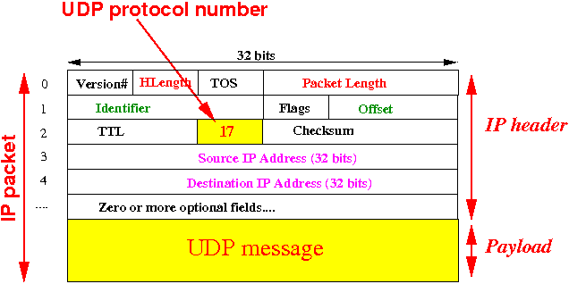
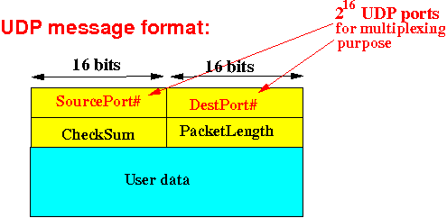
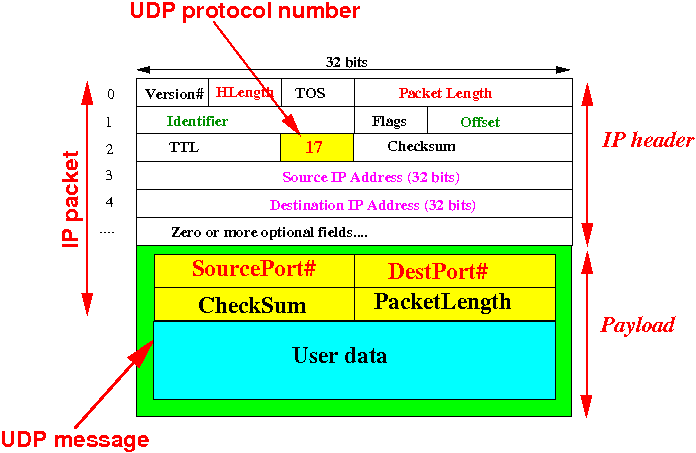

# UDP multicast

## Foundmentals

- IP packet format
  

- UDP packet format
  

- UDP in IP:
  

## Test

### iperf

- iPerf does not support UDP packet size definition
- `iperf --server --udp --bind 239.0.0.1 --interval 1`
- `iperf --client 239.0.0.1 --udp -T 32 --time 30 --interval 1`

### tcpdump

- Funny that `tcpdump` can capture udp packets too
- `tcpdump -i eth0 udp`

## Useful links

- [http://www.cs.emory.edu/~cheung/Courses/455/Syllabus/7-transport/udp.html](http://www.cs.emory.edu/~cheung/Courses/455/Syllabus/7-transport/udp.html)
