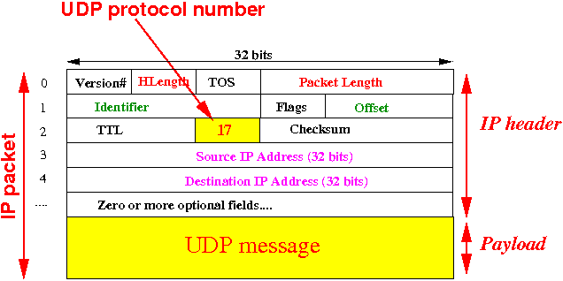

# UDP

## Fundamentals

- IP packet format

  

- UDP packet format

  

- UDP in IP

  

  - You may compare UDP message format with TCP segment
      format [here](https://github.com/alex-lt-kong/network-protocols/blob/main/tcp/README.md)

- Note that source IP and destination IP are two values recorded in an IP
  packet's header, i.e., they are recognized by all the (IP-compliant) network
  devices and useful when routing the packet. On the contrary, destination port
  and source port are not, they are defined by TCP/UDP protocol only, for an ip
  packet, they are nothing but a part of the payload

## Test

### iperf

- iPerf does not support UDP packet size definition
- `iperf --server --udp --bind 239.0.0.1 --interval 1`
- `iperf --client 239.0.0.1 --udp -T 32 --time 30 --interval 1`

### tcpdump

- Funny that `tcpdump` can capture udp packets too
- `tcpdump -i eth0 udp`

## Useful links

- [http://www.cs.emory.edu/~cheung/Courses/455/Syllabus/7-transport/udp.html](http://www.cs.emory.edu/~cheung/Courses/455/Syllabus/7-transport/udp.html)
